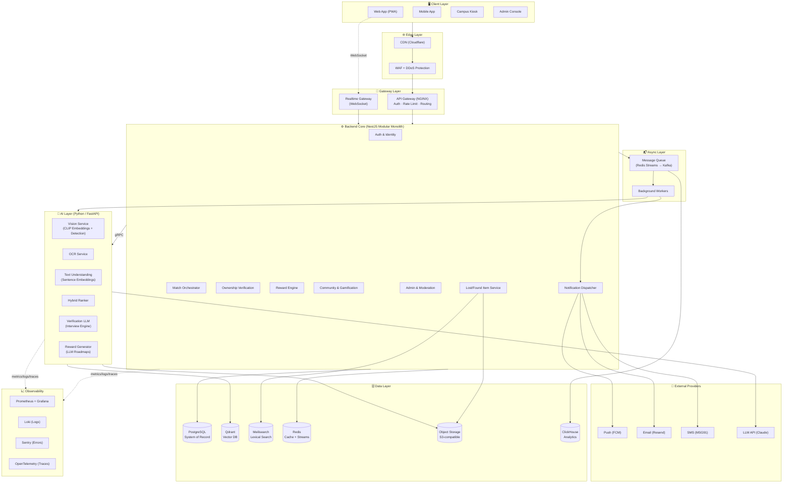
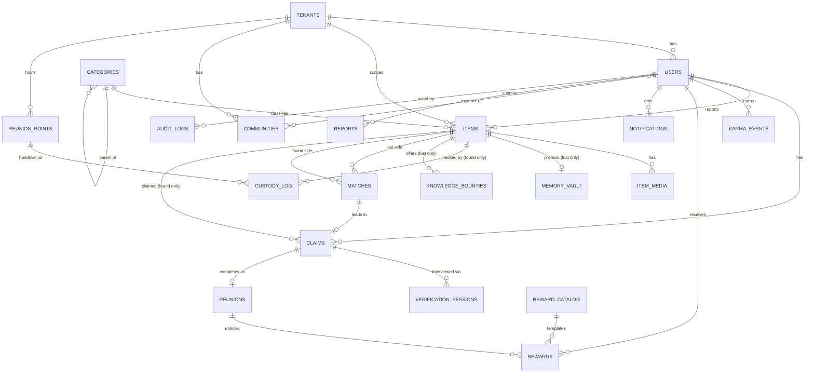
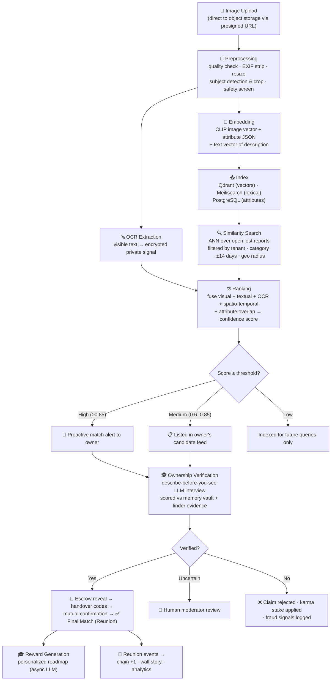
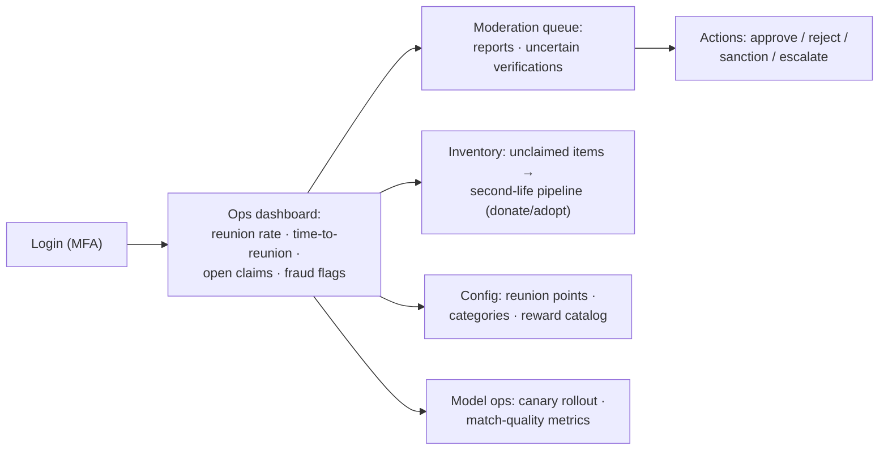
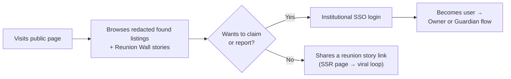

<div align="center">

# 🧭 Reunite

### The AI-First Lost & Found Ecosystem

*Transforming acts of kindness into personal growth — powered by AI, trust engineering, and community intelligence.*


</div>

---

## 📖 Table of Contents

- [🧭 Reunite](#-reunite)
    - [The AI-First Lost \& Found Ecosystem](#the-ai-first-lost--found-ecosystem)
  - [📖 Table of Contents](#-table-of-contents)
  - [1. Project Overview](#1-project-overview)
    - [1.1 Technical Summary](#11-technical-summary)
    - [1.2 Engineering Vision](#12-engineering-vision)
    - [1.3 Core Technical Objectives](#13-core-technical-objectives)
    - [1.4 Technical Philosophy](#14-technical-philosophy)
  - [2. Complete System Architecture](#2-complete-system-architecture)
    - [2.1 Layer Responsibilities](#21-layer-responsibilities)
    - [2.2 Communication Patterns](#22-communication-patterns)
  - [3. High-Level Architecture Diagram](#3-high-level-architecture-diagram)
  - [4. Technology Stack](#4-technology-stack)
  - [5. Folder Structure](#5-folder-structure)
  - [6. System Modules](#6-system-modules)
  - [7. Database Design](#7-database-design)
    - [7.1 Design Principles](#71-design-principles)
    - [7.2 Core Tables](#72-core-tables)
  - [8. Entity Relationship Diagram](#8-entity-relationship-diagram)
  - [9. API Design](#9-api-design)
    - [9.1 Authentication](#91-authentication)
    - [9.2 Users](#92-users)
    - [9.3 Lost Items](#93-lost-items)
    - [9.4 Found Items](#94-found-items)
    - [9.5 Matching](#95-matching)
    - [9.6 Verification (Claims)](#96-verification-claims)
    - [9.7 Rewards](#97-rewards)
    - [9.8 Notifications](#98-notifications)
    - [9.9 Community](#99-community)
    - [9.10 Reports \& Moderation](#910-reports--moderation)
    - [9.11 Admin](#911-admin)
  - [10. AI Architecture](#10-ai-architecture)
  - [11. AI Pipeline](#11-ai-pipeline)
    - [11.1 Found-Item Ingestion → Final Match](#111-found-item-ingestion--final-match)
    - [11.2 Pipeline Guarantees](#112-pipeline-guarantees)
  - [12. User Flows](#12-user-flows)
    - [12.1 Finder (Guardian) Journey](#121-finder-guardian-journey)
    - [12.2 Owner Journey](#122-owner-journey)
    - [12.3 Admin Journey](#123-admin-journey)
    - [12.4 Guest Journey](#124-guest-journey)
  - [13. Security Architecture](#13-security-architecture)
  - [14. Scalability Strategy](#14-scalability-strategy)
  - [15. Deployment Architecture](#15-deployment-architecture)
  - [16. AI Models](#16-ai-models)
  - [17. Search Strategy](#17-search-strategy)
  - [18. Performance Optimization](#18-performance-optimization)
  - [19. Notification Architecture](#19-notification-architecture)
  - [20. Analytics](#20-analytics)
  - [21. Monitoring \& Observability](#21-monitoring--observability)
  - [22. Testing Strategy](#22-testing-strategy)
  - [23. DevOps Pipeline](#23-devops-pipeline)
  - [24. Future Architecture](#24-future-architecture)
  - [25. Roadmap, Contributing \& License](#25-roadmap-contributing--license)
    - [✨ Features](#-features)
    - [🗺️ Roadmap](#️-roadmap)
    - [🚀 Installation (High-Level)](#-installation-high-level)
    - [🤝 Contributing](#-contributing)
    - [📄 License](#-license)
    - [🙏 Acknowledgements](#-acknowledgements)

---

## 1. Project Overview

### 1.1 Technical Summary

**Reunite** is an AI-first Lost & Found ecosystem for educational institutions, architected to scale into organizations, transit systems, and smart-city networks. Rather than a CRUD registry of lost objects, Reunite is a **trust engine**: a multimodal AI pipeline that understands items (vision + text + OCR), matches losses to finds semantically, verifies ownership through information-asymmetric interviews, and rewards finders with AI-generated educational growth plans instead of money.

### 1.2 Engineering Vision

> Build a platform where the **hardest problems — matching, trust, and fraud — are solved by AI**, and the humans only experience the joy of the reunion.

The system is engineered around four pillars:

| Pillar | Engineering Translation |
|---|---|
| **Intelligence** | Every item becomes a multimodal embedding; matching is semantic, not keyword-based |
| **Trust** | Ownership verification is an AI-conducted, asymmetric knowledge test with audit trails |
| **Delight** | Sub-second search, real-time reunion events, personalized reward generation |
| **Scale** | Stateless services, event-driven core, tenant-aware data model from day one |

### 1.3 Core Technical Objectives

1. **≥ 90% match recall** on true lost↔found pairs via hybrid (vector + lexical + spatial-temporal) search.
2. **< 2s p95 latency** for search and matching endpoints.
3. **Zero-trust ownership verification** — claimants never see item details before proving knowledge of them.
4. **Multi-tenant from inception** — one deployment serves many campuses with hard data isolation.
5. **Event-driven extensibility** — every domain action emits events consumed by rewards, analytics, and notifications independently.
6. **Privacy by design** — PII minimization, encrypted storage, region-pinned data residency.

### 1.4 Technical Philosophy

- **Modular monolith first, microservices when metrics demand it.** Premature microservices kill hackathon-to-startup velocity; the codebase is structured so modules can be extracted into services without rewrites.
- **AI as a service layer, not a bolt-on.** The AI layer is an independent, horizontally scalable inference tier with its own lifecycle, versioning, and evaluation harness.
- **Events over direct coupling.** Rewards, notifications, and analytics subscribe to domain events (`item.found`, `match.confirmed`, `reunion.completed`) — new features attach without touching core flows.
- **Boring technology for the core, cutting-edge for the differentiator.** PostgreSQL and Redis run the platform; multimodal embeddings and LLM verification run the magic.

---

## 2. Complete System Architecture

Reunite is organized into **eleven cooperating layers**. Communication follows a strict pattern: synchronous REST/RPC for user-facing reads, asynchronous events for side effects, and gRPC for internal AI inference.

### 2.1 Layer Responsibilities

| Layer | Responsibility | Communicates With |
|---|---|---|
| **Frontend** | PWA + mobile UX, real-time reunion feed, camera capture, offline drafts | API Gateway (HTTPS/REST), Realtime Gateway (WebSocket) |
| **API Gateway** | Routing, authentication enforcement, rate limiting, request validation | All backend services |
| **Backend Core** | Domain logic: items, claims, users, rewards, community | Databases, Message Queue, AI Layer (gRPC) |
| **AI Layer** | Embeddings, OCR, matching, verification interviews, reward generation | Vector DB, Object Storage, LLM providers |
| **Database Layer** | System of record (PostgreSQL), vector index (Qdrant), search index (Meilisearch) | Backend, AI Layer |
| **Storage Layer** | Item images, verification media, generated reward documents | Backend (signed URLs), AI Layer (processing) |
| **Authentication** | Identity, sessions, SSO with institutional identity providers, RBAC | Gateway (token verification), Backend |
| **Notification** | Push, email, SMS, in-app real-time alerts | Message Queue (consumer), external providers |
| **Analytics** | Event warehouse, dashboards, impact metrics | Message Queue (consumer), ClickHouse |
| **Monitoring & Logging** | Metrics, traces, structured logs, alerting | Every service (sidecar/agent model) |
| **Administration** | Moderation console, tenant management, model ops | Backend admin APIs |

### 2.2 Communication Patterns

```
User ──HTTPS──▶ CDN ──▶ API Gateway ──REST──▶ Backend Core
                                   └─WS────▶ Realtime Gateway

Backend Core ──gRPC──▶ AI Inference Services
Backend Core ──SQL───▶ PostgreSQL
Backend Core ──pub───▶ Message Queue (Redis Streams → Kafka at scale)

Message Queue ──sub──▶ Notification Service
              ──sub──▶ Analytics Ingest
              ──sub──▶ Reward Engine
              ──sub──▶ Audit Logger
```

**Design rule:** the request path never blocks on AI or notifications. An item upload returns in milliseconds; embedding, matching, and alerting happen asynchronously, with results pushed to the client over WebSocket.

---

## 3. High-Level Architecture Diagram



---
## 4. Technology Stack

Every choice below optimizes for: **startup velocity**, **cost at zero revenue**, **a credible path to 1M users**, and **hiring-market familiarity**.

| Concern | Choice | Why This Over Alternatives |
|---|---|---|
| **Frontend** | **Next.js 14 (React, TypeScript) as a PWA** | SSR for shareable reunion stories (SEO + link previews), one codebase for web + installable mobile experience, largest talent pool. Chosen over Flutter web (poor SEO) and plain SPA (no SSR). |
| **UI System** | Tailwind CSS + shadcn/ui + Framer Motion | Design-system speed with full ownership of components; Motion powers reunion celebration micro-interactions. |
| **Backend** | **NestJS (Node.js, TypeScript)** | Opinionated modular architecture maps 1:1 to our module boundaries — the modular monolith → microservices path is native. Shares types with frontend via a common package. Chosen over Express (no structure), Django (splits the type system), Spring (velocity cost). |
| **AI Services** | **Python + FastAPI** | The ML ecosystem lives in Python; FastAPI gives async inference endpoints with automatic OpenAPI schemas. gRPC between Node core and Python AI tier. |
| **Authentication** | **Keycloak** (self-hosted OIDC) | Institutional SSO (SAML/OIDC for college identity providers) is a hard requirement for campus adoption; Keycloak gives SSO + RBAC + MFA without per-user SaaS fees. Alternatives: Auth0 (cost at scale), Firebase Auth (weak SAML story). |
| **Primary Database** | **PostgreSQL 16** | ACID system of record; JSONB for flexible item attributes; PostGIS for geospatial loss zones; row-level security for multi-tenancy; battle-tested to millions of users. |
| **Vector Database** | **Qdrant** | Purpose-built ANN search with payload filtering (filter by campus + category + time window *inside* the vector query) — critical for tenant isolation. Rust performance, simple ops, generous OSS license. Alternatives: pgvector (fine to start, weaker filtering at scale), Pinecone (vendor lock-in, cost). |
| **Search Engine** | **Meilisearch** | Typo-tolerant, instant (<50ms) lexical search with faceting — perfect for "black wallet sports block" queries. Lighter to operate than Elasticsearch; ES becomes the upgrade path past ~10M documents. |
| **Cache & Queue (Phase 1)** | **Redis 7** | One dependency, three jobs: cache, rate-limit counters, and Streams-based message queue. Kafka replaces Streams only when event volume justifies it. |
| **Object Storage** | **S3-compatible (Cloudflare R2)** | Zero egress fees (images are served constantly), S3 API portability, native CDN integration. |
| **OCR** | **PaddleOCR** (self-hosted) + Claude vision fallback | PaddleOCR is SOTA open-source and strong on Indian scripts; LLM vision handles handwriting/low-quality edge cases. Google Vision API is the managed alternative at higher cost. |
| **Real-time** | **Socket.IO on a dedicated gateway** | Reunion Bell broadcasts, live claim-interview status, match alerts; Redis adapter for multi-node fan-out. |
| **Notifications** | FCM (push) · Resend (email) · MSG91 (SMS, India-first) | Best-in-class per channel behind one internal dispatcher abstraction — providers are swappable config. |
| **Maps/Geo** | Leaflet + OpenStreetMap + PostGIS | No Google Maps billing risk; PostGIS powers loss-zone heatmaps and radius alerts server-side. |
| **File Uploads** | Direct-to-storage via presigned URLs + Uppy | Uploads bypass the backend entirely — backend only issues signed URLs and receives webhooks. Removes the #1 scaling bottleneck. |
| **CI/CD** | GitHub Actions | Native to the repo; matrix builds for Node + Python; free tier covers early stages. |
| **Containerization** | Docker + Docker Compose (dev) → Kubernetes (scale) | Compose keeps local dev one-command; managed K8s arrives at the 100K-user stage. |
| **Reverse Proxy** | NGINX | TLS termination, rate limiting, static caching; simple, universal, cheap. |
| **Cloud** | **Hetzner/DigitalOcean (Phase 1) → AWS (Phase 3)** | 5–10× cheaper compute pre-revenue; S3-compatible storage and Postgres are portable by design, so migration is a lift, not a rewrite. |
| **Monitoring** | Prometheus + Grafana | Industry-standard pull-based metrics; Grafana doubles as the internal ops dashboard. |
| **Logging** | Loki + structured JSON logs (Pino / structlog) | Grafana-native log aggregation; label-based indexing keeps cost near zero versus ELK. |
| **Error Tracking** | Sentry | Release-aware error grouping across frontend, backend, and Python AI tier. |
| **Tracing** | OpenTelemetry | Vendor-neutral traces across the Node→gRPC→Python boundary — essential for debugging the AI pipeline. |
| **Analytics Store** | ClickHouse | Columnar OLAP for event analytics (millions of events, sub-second aggregates) without burdening PostgreSQL. |
| **Product Analytics** | PostHog (self-hosted) | Funnels, retention, feature flags, A/B testing for gamification experiments — privacy-preserving and free self-hosted. |
| **Security Tooling** | OWASP ZAP, Trivy, Dependabot, HashiCorp Vault | Automated DAST, container scanning, dependency patching, centralized secrets. |
| **LLM Provider** | **Anthropic Claude API** | Powers verification interviews, reward roadmap generation, and vision fallback; strong instruction-following for user-facing dialogue. Abstracted behind an internal `LLMProvider` interface for portability. |

---

## 5. Folder Structure

A **monorepo** (managed with `pnpm workspaces` + `Turborepo`) provides shared types, atomic cross-service changes, and one CI pipeline.

```
reunite/
├── apps/
│   ├── web/                        # Next.js PWA (student-facing)
│   │   ├── src/
│   │   │   ├── app/                # App Router pages & layouts
│   │   │   ├── components/         # UI components (feature-scoped)
│   │   │   ├── features/           # Feature slices (items, claims, rewards, community)
│   │   │   ├── hooks/              # Shared React hooks
│   │   │   ├── lib/                # API client, socket client, utilities
│   │   │   ├── stores/             # Client state (Zustand)
│   │   │   └── styles/
│   │   └── public/
│   ├── admin/                      # Admin & moderation console (Next.js)
│   └── api/                        # NestJS backend core
│       ├── src/
│       │   ├── modules/
│       │   │   ├── auth/           # Sessions, RBAC guards, Keycloak adapter
│       │   │   ├── users/          # Profiles, karma, preferences
│       │   │   ├── items/          # Lost & found item domain
│       │   │   ├── matching/       # Match orchestration (calls AI tier)
│       │   │   ├── verification/   # Claim interviews & escrow reveal
│       │   │   ├── rewards/        # Educational reward engine
│       │   │   ├── community/      # Guilds, chains, reunion wall
│       │   │   ├── notifications/  # Dispatcher + channel adapters
│       │   │   ├── search/         # Meilisearch indexing & queries
│       │   │   ├── analytics/      # Event emission & admin metrics
│       │   │   ├── moderation/     # Reports, content review, fraud flags
│       │   │   └── admin/          # Tenant & platform administration
│       │   ├── common/             # Guards, interceptors, pipes, filters
│       │   ├── events/             # Domain event definitions & bus
│       │   ├── config/             # Typed environment configuration
│       │   └── database/           # Migrations, seeds, Prisma schema
│       └── test/
├── services/
│   └── ai/                         # Python AI tier (FastAPI)
│       ├── app/
│       │   ├── api/                # gRPC + REST inference endpoints
│       │   ├── pipelines/          # Ingest → embed → match orchestration
│       │   ├── models/             # Model loading, versioning, registry
│       │   ├── vision/             # CLIP embeddings, detection, quality checks
│       │   ├── ocr/                # PaddleOCR + LLM fallback
│       │   ├── nlp/                # Text embeddings, attribute extraction
│       │   ├── ranking/            # Hybrid score fusion & re-ranking
│       │   ├── verification/      # Interview engine (LLM prompts, scoring)
│       │   ├── rewards/            # Roadmap generation prompts & templates
│       │   └── evaluation/         # Offline eval harness, golden datasets
│       └── tests/
├── packages/
│   ├── shared-types/               # TypeScript types shared web ↔ api
│   ├── ui/                         # Shared component library
│   ├── config/                     # Shared ESLint/TS/Prettier configs
│   └── sdk/                        # Generated API client (OpenAPI)
├── infra/
│   ├── docker/                     # Dockerfiles per app/service
│   ├── compose/                    # docker-compose.{dev,test}.yml
│   ├── k8s/                        # Helm charts (production phase)
│   ├── nginx/                      # Gateway configuration
│   ├── terraform/                  # Cloud provisioning (IaC)
│   └── monitoring/                 # Prometheus rules, Grafana dashboards
├── docs/
│   ├── architecture/               # ADRs (Architecture Decision Records)
│   ├── api/                        # OpenAPI specs
│   ├── ai/                         # Model cards, eval reports
│   └── runbooks/                   # Incident response procedures
├── scripts/                        # Dev tooling, seeding, data migration
├── .github/workflows/              # CI/CD pipelines
└── turbo.json / pnpm-workspace.yaml
```

**Why this shape:** each `apps/api/src/modules/*` directory is a future microservice boundary — extraction means moving a folder and swapping the in-process event bus for the queue, not a redesign. `packages/shared-types` guarantees the frontend can never drift from backend contracts.

---

## 6. System Modules

| Module | Responsibilities | Key Interactions |
|---|---|---|
| **Authentication** | OIDC/SAML SSO with institutional IdPs, session lifecycle, MFA for admins, token refresh, device management | Keycloak; issues JWTs verified at the gateway |
| **User Management** | Profiles, karma score, guardian levels, privacy preferences, Karma Transcript generation | Emits `user.*` events; consumed by community & analytics |
| **Lost Item Module** | Loss reports, sentimental-priority tagging, memory-vault capture (private ownership details), loss-zone inference | Triggers AI attribute extraction; indexes to Meilisearch |
| **Found Item Module** | Guardian intake flow, image capture, custody tracking (with self / deposited at reunion point), public listing with detail redaction | Presigned uploads; triggers AI pipeline; emits `item.found` |
| **AI Matching Engine** | Orchestrates vision + text + OCR signals into candidate matches; spatial-temporal filtering; confidence scoring | gRPC to AI tier; writes match candidates; emits `match.proposed` |
| **Ownership Verification** | Describe-before-you-see interview flow, LLM-scored answers against the private memory vault, escrow photo reveal, appeal path | Verification LLM; audit-logged; emits `claim.verified` / `claim.rejected` |
| **Reward Engine** | Reward catalog, AI-generated personalized roadmaps (DSA plans, resume guides, learning paths), knowledge-bounty escrow between users | LLM generation; stores artifacts in object storage |
| **Notification System** | Channel routing (push/email/SMS/in-app), user preference honoring, digest batching, quiet hours | Queue consumer; provider adapters |
| **Community Module** | Kindness Chain, department/hostel competitions, Reunion Wall, gratitude notes, Silent Angel anonymity | Consumes reunion events; real-time broadcasts |
| **Search Engine Module** | Hybrid query planning (lexical + vector + geo), redaction-aware public search | Meilisearch + Qdrant fan-out, fused ranking |
| **Analytics Module** | Event ingestion to ClickHouse, impact metrics (₹ saved, CO₂ avoided), campus dashboards | Queue consumer; feeds admin console |
| **Moderation** | Report queues, image safety screening, fraud-flag review, user sanctions | AI safety classifier pre-screen; human review console |
| **Administration** | Tenant onboarding, reunion-point management, category taxonomies, model-version rollout | Superadmin RBAC; feature flags |
| **Reporting** | Scheduled institutional reports (monthly reunion stats, unclaimed inventory), export pipelines | ClickHouse queries; PDF generation workers |

---
## 7. Database Design

### 7.1 Design Principles

- **3NF for the transactional core** (users, items, claims, rewards) — no duplicated facts, referential integrity enforced by FKs.
- **Deliberate denormalization at the edges**: `items.attributes` uses JSONB for category-specific fields (a wallet's "brand/contents" vs a laptop's "make/serial") to avoid an EAV anti-pattern; hot counters (karma, chain length) are cached in Redis and reconciled from the events table.
- **Multi-tenant by column**: every tenant-scoped table carries `tenant_id` with PostgreSQL Row-Level Security policies — one schema, hard isolation.
- **Append-only event & audit tables** — verification and custody are legally sensitive; history is never updated in place.

### 7.2 Core Tables

| Table | Purpose | Key Columns | Indexes |
|---|---|---|---|
| `tenants` | Institutions (campuses/orgs) | `id (PK)`, `name`, `type`, `config JSONB`, `region` | `slug UNIQUE` |
| `users` | Identity + profile | `id (PK, UUID)`, `tenant_id (FK)`, `idp_subject`, `email`, `display_name`, `karma_score`, `guardian_level`, `privacy_prefs JSONB` | `(tenant_id, email) UNIQUE`, `idp_subject UNIQUE` |
| `items` | Unified lost & found items | `id (PK)`, `tenant_id (FK)`, `type ('lost'\|'found')`, `reporter_id (FK users)`, `category_id (FK)`, `title`, `public_desc`, `attributes JSONB`, `status`, `location GEOGRAPHY`, `occurred_at`, `sentimental_priority` | `(tenant_id, type, status)`, GiST on `location`, `occurred_at` |
| `item_media` | Images per item | `id (PK)`, `item_id (FK)`, `storage_key`, `blurhash`, `redaction_level`, `ocr_text` | `item_id` |
| `memory_vault` | **Private** ownership details for lost items (encrypted) | `id (PK)`, `item_id (FK, UNIQUE)`, `encrypted_details BYTEA`, `detail_schema JSONB` | `item_id UNIQUE` |
| `categories` | Item taxonomy | `id (PK)`, `parent_id (self-FK)`, `name`, `attribute_schema JSONB` | `parent_id` |
| `matches` | AI-proposed lost↔found pairs | `id (PK)`, `lost_item_id (FK)`, `found_item_id (FK)`, `score NUMERIC`, `signal_breakdown JSONB`, `status`, `model_version` | `(lost_item_id, found_item_id) UNIQUE`, `status` |
| `claims` | Ownership claims on found items | `id (PK)`, `found_item_id (FK)`, `claimant_id (FK)`, `match_id (FK, NULL)`, `status`, `verification_score`, `decided_at` | `(found_item_id, claimant_id) UNIQUE`, `status` |
| `verification_sessions` | Interview transcripts (append-only) | `id (PK)`, `claim_id (FK)`, `question`, `answer`, `ai_assessment JSONB`, `asked_at` | `claim_id` |
| `custody_log` | Chain of custody for found items (append-only) | `id (PK)`, `item_id (FK)`, `holder_type`, `holder_id`, `handoff_at`, `reunion_point_id (FK, NULL)` | `item_id` |
| `reunions` | Completed returns | `id (PK)`, `claim_id (FK UNIQUE)`, `finder_id (FK)`, `owner_id (FK)`, `completed_at`, `story_visibility`, `gratitude_note` | `finder_id`, `owner_id`, `completed_at` |
| `rewards` | Earned reward instances | `id (PK)`, `user_id (FK)`, `reunion_id (FK)`, `reward_type`, `generated_artifact_key`, `status` | `user_id`, `status` |
| `reward_catalog` | Available reward templates | `id (PK)`, `tenant_id (FK, NULL=global)`, `name`, `type`, `generation_prompt_ref` | — |
| `knowledge_bounties` | Person-to-person offered rewards | `id (PK)`, `lost_item_id (FK)`, `offered_by (FK users)`, `description`, `status` | `lost_item_id` |
| `karma_events` | Append-only karma ledger | `id (PK)`, `user_id (FK)`, `delta`, `reason`, `ref_type`, `ref_id`, `created_at` | `(user_id, created_at)` |
| `communities` | Departments/hostels/clubs | `id (PK)`, `tenant_id (FK)`, `name`, `type` | `(tenant_id, type)` |
| `community_members` | Membership | `(community_id, user_id) PK` | `user_id` |
| `notifications` | In-app inbox | `id (PK)`, `user_id (FK)`, `type`, `payload JSONB`, `read_at`, `created_at` | `(user_id, read_at)` |
| `reports` | Abuse/fraud reports | `id (PK)`, `reporter_id (FK)`, `subject_type`, `subject_id`, `reason`, `status` | `status` |
| `audit_logs` | Admin/security actions (append-only) | `id (PK)`, `actor_id`, `action`, `subject`, `metadata JSONB`, `ip`, `created_at` | `(actor_id, created_at)`, `action` |
| `reunion_points` | Physical handover locations | `id (PK)`, `tenant_id (FK)`, `name`, `location GEOGRAPHY`, `hours JSONB` | GiST on `location` |

**Vector data** (image/text embeddings) lives in **Qdrant**, keyed by `item_id` with payload `{tenant_id, category, type, occurred_at, geo}` for filtered ANN search — Postgres stores only the `embedding_version` marker.

---

## 8. Entity Relationship Diagram



---

## 9. API Design

All endpoints are versioned under `/api/v1`, return a consistent envelope `{ success, data, error, meta }`, and are documented via OpenAPI. Auth legend: 🔓 public · 🔐 authenticated · 🛡️ admin/moderator role.

### 9.1 Authentication

| Method | Endpoint | Auth | Request | Response | Description |
|---|---|---|---|---|---|
| GET | `/auth/login` | 🔓 | `?redirect=` | 302 → IdP | Initiate OIDC/SAML SSO flow |
| POST | `/auth/callback` | 🔓 | `{ code, state }` | `{ accessToken, refreshToken, user }` | Exchange IdP code for session |
| POST | `/auth/refresh` | 🔓 | `{ refreshToken }` | `{ accessToken }` | Rotate access token |
| POST | `/auth/logout` | 🔐 | — | `{ success }` | Revoke session (server-side) |
| GET | `/auth/me` | 🔐 | — | `{ user, roles, tenant }` | Current identity & permissions |

### 9.2 Users

| Method | Endpoint | Auth | Request | Response | Description |
|---|---|---|---|---|---|
| GET | `/users/:id` | 🔐 | — | Public profile + karma + guardian level | Privacy-filtered profile |
| PATCH | `/users/me` | 🔐 | `{ displayName?, privacyPrefs?, notificationPrefs? }` | Updated profile | Self-service profile update |
| GET | `/users/me/karma` | 🔐 | `?page=` | Paginated karma ledger | Full karma history |
| GET | `/users/me/transcript` | 🔐 | `?format=pdf` | Signed URL | Generate verified Karma Transcript |
| GET | `/users/me/items` | 🔐 | `?type=&status=` | Item list | My lost/found reports |

### 9.3 Lost Items

| Method | Endpoint | Auth | Request | Response | Description |
|---|---|---|---|---|---|
| POST | `/lost-items` | 🔐 | `{ category, title, publicDesc, occurredAt, locationHint, sentimentalPriority, memoryVault: {...} }` | `{ item, uploadUrls[] }` | Report a loss; memory vault stored encrypted, never publicly served |
| GET | `/lost-items/:id` | 🔐 | — | Item (vault omitted) | Loss report detail |
| PATCH | `/lost-items/:id` | 🔐 owner | Partial fields | Updated item | Amend report |
| POST | `/lost-items/:id/close` | 🔐 owner | `{ reason }` | `{ status }` | Found elsewhere / withdrawn |
| GET | `/lost-items/:id/matches` | 🔐 owner | — | Ranked match candidates | AI-proposed found items (redacted view) |
| POST | `/lost-items/:id/bounty` | 🔐 owner | `{ description }` | Bounty | Attach a knowledge bounty |

### 9.4 Found Items

| Method | Endpoint | Auth | Request | Response | Description |
|---|---|---|---|---|---|
| POST | `/found-items` | 🔐 | `{ category, locationFound, foundAt, custody: 'self'\|'reunion_point', publicDesc }` | `{ item, uploadUrls[] }` | Guardian intake; AI pipeline triggered on upload webhook |
| GET | `/found-items` | 🔓 | `?q=&category=&near=&since=&page=` | Redacted public listings | Browse/search (details withheld for verification integrity) |
| GET | `/found-items/:id` | 🔓 | — | Redacted item | Public detail (blurred media until claim verified) |
| POST | `/found-items/:id/custody` | 🔐 guardian | `{ handoffTo, reunionPointId? }` | Custody entry | Append chain-of-custody record |
| POST | `/found-items/:id/claim` | 🔐 | `{ }` | `{ claimId, interviewSessionUrl }` | Open a claim → starts verification interview |

### 9.5 Matching

| Method | Endpoint | Auth | Request | Response | Description |
|---|---|---|---|---|---|
| POST | `/matches/:id/confirm-interest` | 🔐 owner | — | `{ claimId }` | Convert match into claim + interview |
| POST | `/matches/:id/dismiss` | 🔐 owner | `{ reason? }` | `{ status }` | Negative feedback → improves ranking |
| GET | `/matches/:id` | 🔐 party | — | Match with signal breakdown | Explainable match view |

### 9.6 Verification (Claims)

| Method | Endpoint | Auth | Request | Response | Description |
|---|---|---|---|---|---|
| GET | `/claims/:id` | 🔐 party | — | Claim status | Claim state machine view |
| POST | `/claims/:id/answers` | 🔐 claimant | `{ questionId, answer }` | `{ nextQuestion \| verdictPending }` | Describe-before-you-see interview turn |
| POST | `/claims/:id/appeal` | 🔐 claimant | `{ reason }` | `{ appealId }` | Human review escalation |
| POST | `/claims/:id/handover/confirm` | 🔐 both parties | `{ code }` | `{ reunionId }` | Mutual handover confirmation → reunion created |

### 9.7 Rewards

| Method | Endpoint | Auth | Request | Response | Description |
|---|---|---|---|---|---|
| GET | `/rewards/catalog` | 🔐 | — | Reward templates | Available educational rewards |
| POST | `/rewards/redeem` | 🔐 | `{ reunionId, catalogId, personalization: { goals, level, timePerWeek } }` | `{ rewardId, status: 'generating' }` | Kick off AI roadmap generation (async) |
| GET | `/rewards/:id` | 🔐 owner | — | Reward + artifact signed URL | Retrieve generated roadmap/plan |
| GET | `/users/me/rewards` | 🔐 | — | Reward list | My earned rewards |

### 9.8 Notifications

| Method | Endpoint | Auth | Request | Response | Description |
|---|---|---|---|---|---|
| GET | `/notifications` | 🔐 | `?unread=&page=` | Notification list | In-app inbox |
| POST | `/notifications/read` | 🔐 | `{ ids[] }` | `{ success }` | Mark read |
| PUT | `/notifications/preferences` | 🔐 | `{ channels, quietHours, digest }` | Preferences | Channel & schedule control |
| POST | `/devices` | 🔐 | `{ fcmToken, platform }` | `{ success }` | Register push device |

### 9.9 Community

| Method | Endpoint | Auth | Request | Response | Description |
|---|---|---|---|---|---|
| GET | `/community/chain` | 🔓 | — | `{ length, since, lastReunion }` | Campus Kindness Chain state |
| GET | `/community/wall` | 🔓 | `?page=` | Reunion stories (consented) | Reunion Wall feed |
| GET | `/community/standings` | 🔓 | `?type=department\|hostel` | Return-rate leaderboard | Community competition |
| POST | `/reunions/:id/gratitude` | 🔐 owner | `{ note, visibility }` | Gratitude note | Post-reunion appreciation |

### 9.10 Reports & Moderation

| Method | Endpoint | Auth | Request | Response | Description |
|---|---|---|---|---|---|
| POST | `/reports` | 🔐 | `{ subjectType, subjectId, reason }` | `{ reportId }` | Report abuse/fraud/spam |
| GET | `/moderation/queue` | 🛡️ | `?status=` | Report queue | Moderator work queue |
| POST | `/moderation/reports/:id/action` | 🛡️ | `{ action, note }` | `{ status }` | Resolve with sanction/dismissal |

### 9.11 Admin

| Method | Endpoint | Auth | Request | Response | Description |
|---|---|---|---|---|---|
| GET | `/admin/analytics/overview` | 🛡️ | `?range=` | KPI dashboard payload | Reunion rate, median time-to-reunion, active guardians |
| GET | `/admin/items/unclaimed` | 🛡️ | `?olderThan=` | Inventory list | Second-life (donation/adoption) pipeline |
| POST | `/admin/reunion-points` | 🛡️ | `{ name, location, hours }` | Reunion point | Manage handover locations |
| POST | `/admin/tenants` | 🛡️ super | `{ name, type, idpConfig }` | Tenant | Onboard a new institution |
| POST | `/admin/models/rollout` | 🛡️ super | `{ modelVersion, trafficPct }` | Rollout state | Canary a new embedding/ranker version |

---
## 10. AI Architecture

The AI layer is the product's moat. It consists of **eight cooperating components**, each independently versioned and evaluated.

| Component | Function | Approach |
|---|---|---|
| **Image Understanding** | Convert item photos into a semantic representation | CLIP-family multimodal embedding (single vector space for images *and* text — a photo of a bottle matches the phrase "blue sports bottle") |
| **Object Recognition** | Detect item type, crop to subject, validate quality | Open-vocabulary detection to auto-categorize, reject blurry/irrelevant uploads, and crop backgrounds before embedding |
| **Feature Extraction** | Structured attributes (color, brand, material, distinguishing marks) | LLM vision prompt with a category-specific JSON schema; feeds lexical search facets and match explanations |
| **OCR** | Read text on items (names on books, IDs, stickers, engravings) | PaddleOCR primary; LLM vision fallback for handwriting. Extracted PII is stored encrypted and **never shown publicly** — it becomes a high-precision private matching signal |
| **Text Understanding** | Embed loss descriptions and search queries | Sentence-embedding model in the same retrieval space; multilingual so a Tamil description matches an English one |
| **Similarity Search** | Candidate retrieval | Qdrant ANN over image+text embeddings with payload filters (tenant, category, time window, geo radius) |
| **Ranking System** | Fuse signals into one confidence score | Weighted fusion: visual similarity + text similarity + OCR exact-match boost + spatial-temporal plausibility + attribute overlap; upgraded to a learned (gradient-boosted) ranker once labeled match outcomes accumulate |
| **Ownership Verification** | Prove the claimant knows the item | LLM interview engine: generates questions from the finder's private evidence, scores claimant answers against it, returns a calibrated confidence with per-question rationale (audit-logged) |
| **Recommendation** | Personalized educational rewards + proactive nudges | LLM generation from user goals (roadmaps, prep plans); collaborative signals recommend Lookout Mode routes and loss-prevention tips |

**Data-flow rule:** the backend never talks to models directly — it calls the AI tier over gRPC with typed contracts; the AI tier owns model choice, versioning, batching, and fallbacks. Every inference result records `model_version` for reproducibility and A/B analysis.

---

## 11. AI Pipeline

### 11.1 Found-Item Ingestion → Final Match



### 11.2 Pipeline Guarantees

- **Async by default** — upload returns instantly; pipeline stages are queue-driven workers with per-stage retries and dead-letter queues.
- **Idempotent stages** — re-running embedding or OCR on the same media is safe (content-hash keyed).
- **Explainability** — every match stores a `signal_breakdown` so the UI can say *"matched on: visual similarity 92%, found 40m from your reported route, 2h after loss window."*
- **Continuous learning loop** — confirmed/dismissed matches become labeled training data for the learned ranker.

---

## 12. User Flows

### 12.1 Finder (Guardian) Journey

```mermaid
flowchart LR
    A["Finds an item"] --> B["Opens app →<br/>'Become its Guardian'"]
    B --> C["Photo + where/when found"]
    C --> D["Chooses custody:<br/>keep safely / deposit at Reunion Point"]
    D --> E["AI pipeline runs<br/>(seconds, async)"]
    E --> F{"Match found?"}
    F -- Yes --> G["Owner alerted →<br/>verification begins"]
    F -- "Not yet" --> H["Item listed (redacted) ·<br/>guardian gets status updates"]
    G --> I["Owner verified →<br/>handover at Reunion Point<br/>mutual code confirmation"]
    H --> G
    I --> J["🔔 Reunion Bell rings campus-wide"]
    J --> K["Finder chooses reward:<br/>AI roadmap / bounty / donate karma"]
    K --> L["Gratitude note received ·<br/>Karma Transcript updated"]
```



### 12.2 Owner Journey

```mermaid
flowchart LR
    A["Realizes item is lost"] --> B["Calm Protocol:<br/>recovery odds + next steps shown"]
    B --> C["Reports loss:<br/>description + private memory vault<br/>(distinguishing details only they know)"]
    C --> D["AI reconstructs probable<br/>loss zone & time window"]
    D --> E["Continuous matching<br/>against found intake"]
    E --> F["Match alert (redacted preview)"]
    F --> G["Describe-before-you-see interview"]
    G --> H{"Passed?"}
    H -- Yes --> I["Full reveal → schedule handover"]
    H -- No --> J["Feedback + appeal path"]
    I --> K["Handover confirmed → Reunion"]
    K --> L["Sends gratitude note ·<br/>optionally shares story to Wall"]
```



### 12.3 Admin Journey



### 12.4 Guest Journey



---

## 13. Security Architecture

| Domain | Design |
|---|---|
| **Authentication** | OIDC via Keycloak; short-lived JWT access tokens (15 min) + rotating refresh tokens; MFA mandatory for admin/moderator roles; device/session management with server-side revocation. |
| **Authorization** | RBAC (student, guardian, moderator, tenant-admin, superadmin) enforced by gateway + NestJS guards; **resource-level checks** (only the claimant sees their interview; only parties see a claim); PostgreSQL Row-Level Security as tenant-isolation backstop. |
| **Encryption** | TLS 1.3 everywhere; AES-256 at rest for databases and object storage; **application-level envelope encryption** for the memory vault and OCR-extracted PII (per-tenant data keys wrapped by a KMS master key). |
| **Access Control for Media** | All item images served via short-lived signed URLs; public listings serve blurred/redacted renditions; originals unlock only after verified claims. |
| **Rate Limiting** | Gateway token-bucket per user + IP (Redis counters); strict budgets on claim attempts (3 active claims/user), interview answers, and OTP endpoints; exponential backoff on failures. |
| **Audit Logs** | Append-only `audit_logs` + full verification transcripts; admin actions, reveals, and custody handoffs all logged with actor, IP, and timestamp; logs shipped to Loki with retention policy. |
| **Fraud Detection** | Karma staking (false claims cost visible reputation); velocity rules (claim bursts, multi-account device fingerprints); anomaly flags routed to moderation; verification LLM adversarially prompted against answer-fishing. |
| **Secure Uploads** | Presigned URLs with content-type + size constraints; server-side MIME sniffing; EXIF/GPS stripping; AI safety screen (NSFW/violence) before any image becomes visible; malware scanning on non-image files. |
| **Privacy Protection** | PII minimization (contact details exchanged only post-verification via masked relay); consent-gated story publishing; DPDP/GDPR-aligned data subject rights (export, deletion); per-tenant data residency pinning. |
| **Secrets Management** | HashiCorp Vault (or cloud KMS) for all credentials; no secrets in env files or CI logs; short-TTL dynamic database credentials; quarterly rotation policy. |
| **Application Security** | OWASP ASVS-aligned; input validation at DTO layer; CSP + strict CORS; dependency scanning (Dependabot) + container scanning (Trivy) + DAST (ZAP) in CI. |

---

## 14. Scalability Strategy

The architecture scales in **deliberate phases** — each phase changes topology, not code structure.

| Stage | Users | Topology | Key Moves |
|---|---|---|---|
| **Pilot** | 100 | Single VM: Compose stack (all services + Postgres + Redis + Qdrant) | Correctness over capacity; nightly backups |
| **Campus** | 1,000 | 2 app VMs behind NGINX; managed Postgres; Redis primary/replica | CDN for all media; presigned direct uploads; DB connection pooling (PgBouncer) |
| **Multi-Campus** | 10,000 | App tier autoscaled (3–6 nodes); AI tier split to dedicated GPU/CPU inference nodes; read replicas | Redis Streams consumer groups; Meilisearch dedicated node; per-tenant metrics |
| **Regional** | 100,000 | Managed Kubernetes; **first true microservice extractions**: AI inference, notifications, analytics ingest | Kafka replaces Streams; ClickHouse cluster; Qdrant sharded; horizontal pod autoscaling on queue depth |
| **National** | 1,000,000+ | Multi-region cells (a cell = full stack per region); global edge routing | Cell-based isolation (a region outage never crosses cells); Citus/partitioned Postgres by tenant; embedding inference on batched GPU pools; model-serving autoscale |

**Mechanism summary**

- **Horizontal scaling:** all app and AI services are stateless — session state in Redis, files in object storage — so scaling = adding replicas.
- **Vertical scaling:** reserved for PostgreSQL first (simplest win), until partitioning/read-replicas take over.
- **Load balancing:** NGINX (L7) → cloud LB → K8s ingress as phases advance; WebSocket sticky sessions via Redis adapter.
- **Caching:** four tiers — CDN (media, public pages) → Redis (sessions, hot listings, leaderboards, chain counters) → application memoization → DB materialized views.
- **Queues:** every non-request-path workload (embedding, OCR, notifications, analytics, reward generation) is queued; backpressure is absorbed by workers, never by users.
- **CDN:** all images and SSR-cached public story pages served from edge; India-heavy PoP coverage prioritized.

---

## 15. Deployment Architecture

| Environment | Purpose | Shape |
|---|---|---|
| **Development** | Local, one command | `docker compose up` — full stack with seeded demo data and a mock IdP |
| **Testing/Staging** | CI targets + pre-prod | Ephemeral preview environments per PR (frontend) + persistent staging mirroring prod topology at 1/10 scale |
| **Production** | Live traffic | Containerized services; managed Postgres with PITR; blue-green app deploys; canary rollout for AI model versions |

**CI/CD:** GitHub Actions — lint → typecheck → unit tests → build images → integration tests against Compose stack → security scans → push to registry → staged deploy (staging auto, production on approval) with automatic rollback on failed health checks.

**Disaster Recovery & Backups**

- PostgreSQL: continuous WAL archiving + point-in-time recovery; nightly full snapshots, 30-day retention, cross-region copies.
- Object storage: versioned buckets + cross-region replication for reunion-critical media.
- Qdrant/Meilisearch: treated as **rebuildable projections** — snapshots for speed, but full reindex from Postgres + storage is a tested runbook (indexes are never the source of truth).
- Targets: **RPO ≤ 15 min, RTO ≤ 1 hour**, verified by quarterly restore drills.

---

## 16. AI Models

| Task | Primary Recommendation | Why | Alternatives | Trade-offs |
|---|---|---|---|---|
| **Image + text retrieval embeddings** | **OpenCLIP ViT-L/14** (self-hosted) | One shared vector space for photos and descriptions — the core matching trick; open weights, no per-call cost, fine-tunable on item domains | SigLIP (better zero-shot, similar ops); cloud multimodal embedding APIs (zero ops, per-call cost, data egress) | ViT-L needs a modest GPU; ViT-B/32 runs on CPU at some recall loss — good pilot fallback |
| **Object detection / crop** | **YOLO-World / Grounding-DINO (open-vocabulary)** | Detects arbitrary item classes without training a custom detector | YOLOv8 fixed-class (faster, needs class list) | Open-vocab is heavier; run only at ingest, never at query time |
| **OCR** | **PaddleOCR** | Strong multilingual + Indic script support, self-hosted, fast | Tesseract (weaker on scenes), Google Vision (best accuracy, cost + data egress) | Handwriting is weak everywhere → LLM-vision fallback path |
| **Text embeddings** | **BGE-M3 / multilingual-E5** | Multilingual, strong retrieval benchmarks, self-hosted | Cloud embedding APIs | Keep text + image models version-locked together — mixed versions corrupt the shared space |
| **Verification interviews & attribute extraction** | **Claude Sonnet (API)** | Reliable structured JSON output, nuanced answer-scoring, safe user-facing dialogue | Self-hosted Llama-class models (no per-call cost; weaker judgment, GPU ops burden) | API dependency mitigated by `LLMProvider` abstraction + response caching |
| **Reward roadmap generation** | **Claude Sonnet**, async batch | Long-form personalized plans; quality is the reward's entire value | Smaller hosted models for templated sections | Generated async → latency invisible; cost bounded per reunion |
| **Re-ranking (Phase 2)** | **LightGBM learned ranker** on match outcomes | Cheap, interpretable, trains on the platform's own confirm/dismiss labels | Neural cross-encoder re-ranker (better ceiling, higher serving cost) | Needs ~5–10K labeled outcomes before it beats the hand-tuned fusion |

**Model governance:** every model has a model card in `docs/ai/`, an offline eval on a golden dataset (precision/recall@k for retrieval, agreement-with-human for verification), version pinning in inference config, and canary rollout with automatic revert on metric regression.

---

## 17. Search Strategy

| Mode | Engine | Used For | Notes |
|---|---|---|---|
| **Lexical (text) search** | Meilisearch | "black wallet sports block" style queries; typo-tolerant, faceted (category, date, zone) | <50ms; indexes public fields only — redaction enforced at index time |
| **Image search** | Qdrant (CLIP image vectors) | "Search by photo" — owner uploads a photo of a similar item | Same vector space as text |
| **Semantic search** | Qdrant (text vectors) | Meaning-level matching: "bottle with anime stickers" ↔ "flask covered in cartoon decals" | Multilingual cross-matching |
| **Hybrid search** | Fusion layer | All user-facing search | Reciprocal Rank Fusion of lexical + vector lists, then business re-rank (recency, geo proximity, sentimental priority) |
| **Private high-precision signals** | Postgres (encrypted) | OCR'd names/IDs matched exactly against loss reports | Never exposed in search UI — triggers direct owner alerts only |

**Query planning:** short keyword-y queries weight lexical higher; descriptive natural-language queries weight vectors higher; a photo query is vector-only + facet filters. All searches are tenant-filtered at the engine level, not in application code.

---

## 18. Performance Optimization

- **Caching:** CDN for media and public pages; Redis for sessions, hot found-item feeds (30s TTL), leaderboards/chain counters (write-through), and idempotent AI results keyed by content hash (an identical re-upload never re-runs OCR/embedding).
- **Lazy loading:** route-level code splitting; infinite-scroll listings with cursor pagination; blurhash placeholders render instantly while images stream.
- **Compression:** Brotli for text responses; images transcoded to AVIF/WebP renditions at ingest (thumb/card/full) — originals kept only in cold storage.
- **Image optimization:** client-side downscale before upload (saves mobile data); server renditions generated once by workers; EXIF stripped.
- **Database optimization:** covering indexes on all hot paths (`(tenant_id, type, status)`, GiST geo); PgBouncer pooling; `karma_events`/`audit_logs` partitioned by month; materialized views for standings refreshed on a schedule.
- **Query optimization:** cursor (keyset) pagination everywhere — no OFFSET scans; N+1 eliminated via dataloader batching; slow-query log budget: any query >100ms p95 gets an ADR or an index.
- **Batch processing:** embeddings batched per GPU pass; notifications digested per user per window; analytics events micro-batched into ClickHouse; reward generation queued off-peak-priority.

---

## 19. Notification Architecture

A single **Notification Dispatcher** consumes domain events, applies user preferences + quiet hours + channel policy, and fans out to adapters.

| Channel | Provider | Used For |
|---|---|---|
| **Push (FCM)** | Firebase Cloud Messaging | Match alerts, claim status, handover reminders — the urgency channel |
| **Email** | Resend | Verification summaries, Karma Transcript delivery, weekly campus digest |
| **SMS** | MSG91 | High-priority only: verified match on a sentimental-priority item, handover OTPs — cost-controlled |
| **In-app real-time** | Socket.IO | Reunion Bell broadcasts, live interview status, chain updates |
| **Scheduled** | Worker cron over queue | Digests, loss-zone smart nudges ("exam hall 3 today — check your pockets"), stale-claim reminders, second-life notifications |

**Policies:** per-user channel preferences and quiet hours honored by the dispatcher, not by callers; deduplication window prevents multi-channel spam for one event; all sends recorded for delivery analytics; template versioning with localization (English/Tamil/Hindi first).

---

## 20. Analytics

All domain events flow (via queue) into **ClickHouse**; dashboards render in the admin console and Grafana.

| Audience | Metrics |
|---|---|
| **Admin / Institution** | Reunion rate, median time-to-reunion, open inventory age, loss heatmaps by zone/time, moderation SLA, unclaimed second-life throughput |
| **Community** | Kindness Chain length & records, department/hostel return-rate standings, active guardians, gratitude-note volume |
| **AI Ops** | Match precision/recall@k (from confirm/dismiss labels), verification pass/fraud-catch rates, per-model latency & cost, embedding drift monitors |
| **User (private)** | Personal karma history, items guarded, reunions completed, reward artifacts — feeds the Karma Transcript |
| **Business** | WAU/MAU, activation funnel (report→match→reunion), retention cohorts, tenant health scores, viral coefficient of shared story pages |
| **Impact** | ₹ value of items returned, replacement purchases avoided, estimated CO₂ saved, mentorship bounties completed — the "Kindness GDP" dashboard for institutional stakeholders |

Product analytics (funnels, A/B tests on gamification mechanics) run in self-hosted PostHog with feature-flag integration.

---

## 21. Monitoring & Observability

| Concern | Tooling | Practice |
|---|---|---|
| **Metrics** | Prometheus + Grafana | RED metrics per endpoint (rate/errors/duration), queue depth, worker lag, GPU utilization, per-model inference latency |
| **Logs** | Pino/structlog → Loki | Structured JSON with `trace_id`, `tenant_id`, `request_id`; PII scrubbed at source |
| **Tracing** | OpenTelemetry → Tempo | End-to-end traces across Next.js → NestJS → gRPC → Python AI → Qdrant; the debugging backbone for pipeline latency |
| **Errors** | Sentry | Release-tagged, source-mapped, alert-routed by module owner |
| **Health checks** | `/healthz` (liveness) + `/readyz` (deps: DB, Redis, Qdrant, queue) | Load balancers and K8s probes gate traffic on readiness |
| **Alerts** | Alertmanager → Slack/PagerDuty | SLO-based: API p95 > 2s, error rate > 1%, queue lag > 5 min, match-quality metric regression, backup failure |
| **Performance** | Grafana SLO dashboards + k6 trend runs | Weekly load-test trend against staging; performance budgets enforced in CI for frontend bundles |

**SLOs:** 99.9% API availability · p95 read < 500ms · p95 search < 2s · match-alert delivery < 60s from found-item ingest.

---

## 22. Testing Strategy

| Layer | Approach | Tooling |
|---|---|---|
| **Unit** | Domain logic, ranking fusion math, guards, reducers — 80%+ on core modules | Jest (TS), pytest (Python) |
| **Integration** | Module ↔ DB ↔ queue behavior against real dependencies | Testcontainers (Postgres/Redis/Qdrant), pytest fixtures |
| **API / Contract** | Every endpoint vs OpenAPI schema; consumer-driven contracts between web SDK and API | Supertest + Schemathesis |
| **UI / E2E** | Critical journeys: report loss → match → interview → reunion; a11y checks | Playwright + axe-core |
| **AI evaluation** | Golden datasets: retrieval precision/recall@k, OCR accuracy by script, verification agreement-with-human, adversarial fraud prompts; regression gate in CI on every model/prompt change | Custom eval harness in `services/ai/evaluation` |
| **Load** | Search, upload webhook, and match fan-out under 10× expected peak; soak tests for workers | k6 |
| **Security** | SAST + dependency scan every PR; DAST on staging weekly; annual external pentest target | Semgrep, Trivy, OWASP ZAP |
| **Acceptance** | Per-feature acceptance criteria in issue templates; staging sign-off checklist including moderation and privacy flows | Manual + Playwright smoke pack |

---

## 23. DevOps Pipeline

- **Version control:** GitHub monorepo; conventional commits enforced; CODEOWNERS per module.
- **Branching:** trunk-based — short-lived feature branches → PR → `main`; release tags cut from `main`; no long-lived develop branch (velocity + small diffs).
- **CI (per PR):** affected-only builds via Turborepo → lint + typecheck → unit tests → integration tests (Compose services) → AI eval smoke (goldens subset) → security scans → preview deploy for frontend.
- **Build:** multi-stage Docker images (distroless runtime), SBOM generated, images signed (cosign), pushed to registry tagged by commit SHA.
- **CD:** auto-deploy to staging on merge → smoke pack → manual approval gate → production **blue-green** deploy; AI model versions ship separately via **canary traffic split** with metric guards.
- **Rollback:** blue-green makes app rollback a router flip (<1 min); DB migrations are expand-migrate-contract (always backward-compatible one release); model rollback = config pin to prior version; every deploy records a rollback runbook link.

```mermaid
flowchart LR
    A["PR opened"] --> B["Lint · Typecheck · Unit"]
    B --> C["Integration tests<br/>(containers)"]
    C --> D["Security scans<br/>SAST · deps · image"]
    D --> E["Build + sign images"]
    E --> F["Merge → main"]
    F --> G["Auto-deploy Staging"]
    G --> H["Smoke + AI eval gate"]
    H --> I{"Approve?"}
    I -- Yes --> J["Blue-green Production"]
    J --> K["Health + SLO watch"]
    K -- "Regression" --> L["Auto rollback<br/>(router flip)"]
```



---

## 24. Future Architecture

The multi-tenant core is deliberately generic: a **tenant** is any bounded trust community. Expansion is configuration + integration, not re-architecture.

| Context | What Changes | Architectural Additions |
|---|---|---|
| **Schools** | Guardians are staff; parent notification channel; simplified UX | Parent-linked accounts; stricter minor-privacy mode (no public profiles, no photos of personal items) |
| **Universities (multi-campus)** | Cross-campus matching within one institution | Tenant hierarchies (org → campus); federated search across sibling tenants |
| **Companies** | Badge/asset integration; HR SSO; rewards become L&D credits | SCIM provisioning; asset-management system connectors; rewards adapter SPI |
| **Hospitals** | High-sensitivity items (documents, devices); strict chain of custody | Mandatory custody signatures; retention/compliance policies per item class; staff-only guardianship |
| **Railways** | Massive volume, anonymous crowds, station-based custody | Kiosk-first intake at stations; item lifecycle SLAs; integration with station storage inventory; national ID-verified claims |
| **Airports** | Regulatory custody, cross-airline handoffs | Interline handoff protocol; security screening flags; multilingual traveler UX; time-boxed escalation to airline systems |
| **Smart Cities** | Many independent operators, one citizen experience | **Reunite Protocol**: a federation API where city transit, malls, and police lost-property registries publish standardized found-item records; citizens search one pane; matching runs across federated indexes with per-operator data sovereignty |
| **Nationwide** | Scale + jurisdictional data residency | Cell-based multi-region deployment; per-state data pinning; portable Karma Transcript as a verifiable credential (W3C VC) that follows a person across every deployment |

**The end-state thesis:** Reunite evolves from an app into a **protocol** — standardized item passports, federated found-item registries, an interview-based verification standard, and portable, cryptographically verifiable kindness credentials.

---

## 25. Roadmap, Contributing & License

### ✨ Features

- 🧠 **Multimodal AI matching** — photos, descriptions, OCR, place, and time fused into one confidence score
- 🕵️ **Describe-before-you-see verification** — fraud-resistant, AI-conducted ownership interviews
- 🎓 **Educational rewards** — AI-generated personalized roadmaps instead of money
- 🔔 **Reunion Bell** — real-time, campus-wide celebration of every return
- 🔗 **Kindness Chain & community standings** — return-rate competition that can't be gamed
- 📜 **Karma Transcript** — institution-verified record of integrity
- 🔒 **Privacy-first** — encrypted memory vaults, redacted listings, masked contact relay
- 🏛️ **Multi-tenant from day one** — one platform, many institutions, hard isolation

### 🗺️ Roadmap

| Phase | Milestone |
|---|---|
| **v0.1 — Pilot** | Core report/find/match/verify/reunion loop, single campus, hand-tuned ranking |
| **v0.2 — Community** | Kindness Chain, Reunion Wall, standings, gratitude notes, reward catalog v1 |
| **v0.3 — Intelligence** | Learned re-ranker, Lookout Mode, loss-zone nudges, Sherlock timeline reconstruction |
| **v1.0 — Multi-campus** | Tenant onboarding self-serve, Karma Transcript export, admin analytics suite |
| **v2.0 — Federation** | Reunite Protocol APIs, city/transit pilots, verifiable-credential transcripts |

### 🚀 Installation (High-Level)

```
1. git clone <repo> && cd reunite
2. cp .env.example .env          # fill provider keys (LLM, FCM, storage)
3. docker compose up             # full stack: web · api · ai · postgres · redis · qdrant · meilisearch
4. pnpm seed:demo                # demo tenant, users, items, and matches
5. open http://localhost:3000
```

### 🤝 Contributing

1. Read `docs/architecture/` ADRs before proposing structural changes.
2. Fork → feature branch → conventional commits → PR with tests.
3. AI/prompt changes must include eval results against the golden dataset.
4. All PRs require green CI (lint, tests, security scans) and one code-owner review.

### 📄 License

MIT — see `LICENSE`. AI model weights and third-party services retain their own licenses (documented in `docs/ai/model-cards/`).

### 🙏 Acknowledgements

Built on the shoulders of the open-source community: PostgreSQL, Qdrant, Meilisearch, OpenCLIP, PaddleOCR, NestJS, Next.js, and the ecosystems around them.

---

<div align="center">

**Reunite** — *where lost things find their way home, and kindness compounds.*

</div>